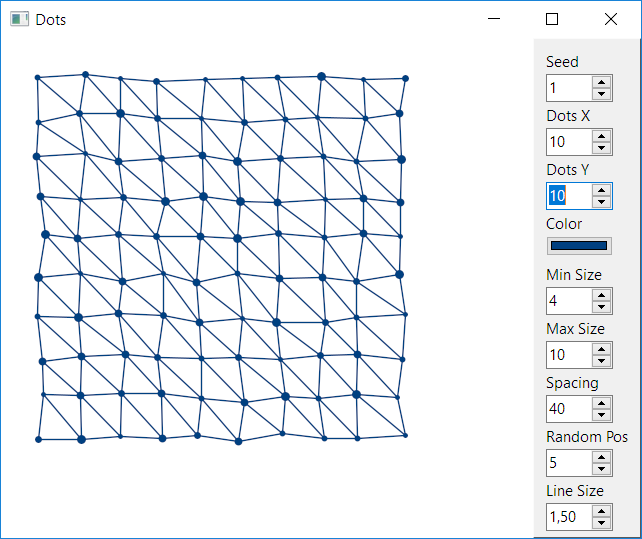
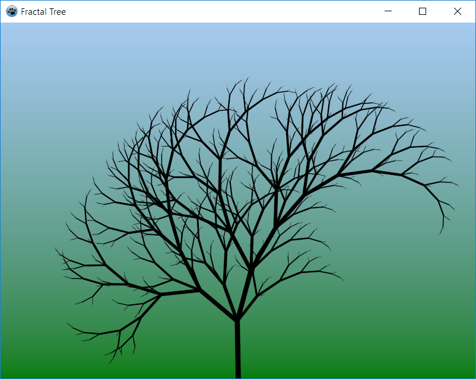
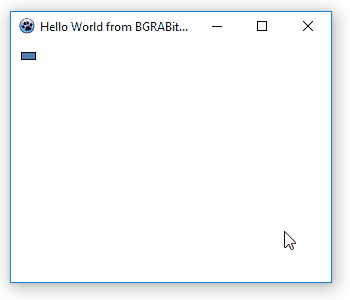
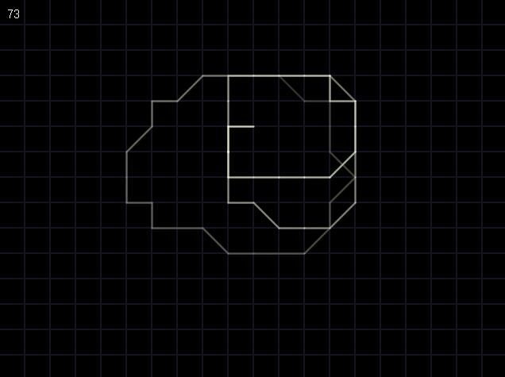
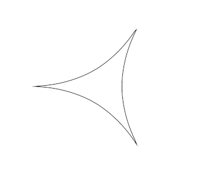
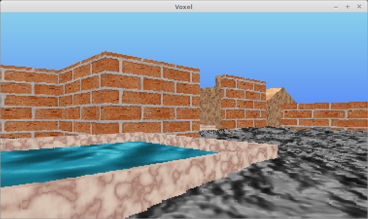
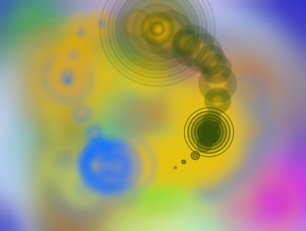

# demo
Sample projects made with BGRABitmap and related packages

## dots
This is a demo to play with random, dots and lines.

## fractal_tree
🌲 with randomness, to make it fractal, tweak it a bit adding even values.

## hello_world
This is an example of animations with easings and how to use them with BGRABitmap.

## hello_world_2
This is the second example of animations with easings, including image manipulation (load from file and stretch draw).

## mouse_down_and_draw_circles
Hold the mouse button down and draw a circle (it vanishes due to animation). When you do that score increases.

## mouse_tail
This is an animation of a line that follows the mouse cursor.

## superformula
This is an animation based on the superformula.

## superformula_ui
This is the same algorythm of the superformula, but you can tweak it with controls (set color, line widh, and actual formula values).

## turtlegraphics
This is an animation with the technique turtle graphics.

## voxel
Move with arrows. Jump and crouch with page up/down. You can go outside of the map and see from the outside.

## waves
Move the mouse and click to draw.

